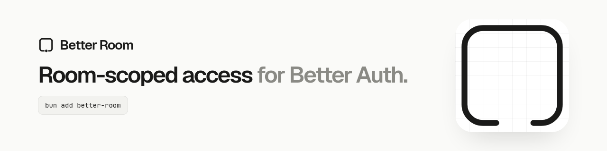

<picture>
  <source media="(prefers-color-scheme: dark)" srcset="public/banner-dark.gif">
  
</picture>

# better-room

Room-scoped contextual authorization for [Better Auth](https://better-auth.com).

Someone presenting a room code gets a membership, not an identity: joining is not authenticating. Better Auth owns who someone is, your application owns what each role may do, and better-room owns who is in which room, and for how long.

## Why use it

Many products let people into a shared space with just a short code: a classroom quiz, a support session, a game lobby. better-room is the hard parts of that, done once.

- **Join without an account**, and keep the membership when the person signs up.
- **Capacity that holds** when many people race for the last seat.
- **Codes safe to leak a database over**: stored only as an HMAC, rate limited, rotatable.
- **Authorization, not just membership**: lock, close, expire and revoke, with your own roles.
- **Realtime stays yours**: `onChange` reports each saved change, and you broadcast it.

It is not an identity provider, a permission engine or a realtime server.

## Install

```sh
npm install better-room
```

The plugin uses your application's copy of Better Auth. If you install with Yarn, which does not add peer dependencies for you, also run `yarn add better-auth @better-auth/core better-call zod`.

## Set up

Server:

```ts
import { betterAuth } from 'better-auth'
import { betterRoom } from 'better-room'

export const auth = betterAuth({
  database: /* your adapter */,
  plugins: [betterRoom()]
})
```

Client:

```ts
import { createAuthClient } from 'better-auth/client'
import { betterRoomClient } from 'better-room/client'

export const client = createAuthClient({
  plugins: [betterRoomClient()]
})
```

Then run Better Auth's migration or schema generation so the room tables exist.

## Quick start

Create a room on the server and keep the code it returns. It is the only time the plaintext is readable.

```ts
const { room, code } = await auth.api.createRoom({
  body: { maxMembers: 8, expiresAt: new Date(Date.now() + 3_600_000) }
})
```

Let people join with that code from the client:

```ts
const { data, error } = await client.betterRoom.join({ code: 'K7QD2M4P' })

if (error) throw new Error(error.message)

const { roomId } = data.membership
```

Check whether someone may act in a room, over HTTP or when a WebSocket opens:

```ts
const { data } = await client.betterRoom.access({ query: { roomId } })

if (data?.authorized) {
  // let them in
}
```

Hear about changes after they are saved:

```ts
betterRoom({
  onChange: event => {
    if ('roomId' in event) sockets.to(event.roomId).emit(event.type, event)
  }
})
```

Commands go over HTTP and live updates go over your own socket. `onChange` is the bridge between the two.

Adding members with a role, revoking, rotating codes, locking, closing and reconciling capacity are administrative: they have no HTTP route, and your backend calls them through `auth.api` after deciding who may.

```ts
await auth.api.lockRoom({ body: { roomId } })
```

## Learn more

The full reference lives in [docs/reference.md](docs/reference.md): every operation and route, options, realtime, error codes, database schema, the guarantees the plugin keeps and what it deliberately leaves out.

## License

[Apache-2.0](LICENSE)
